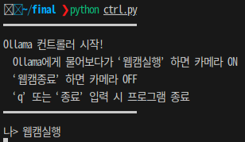
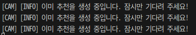
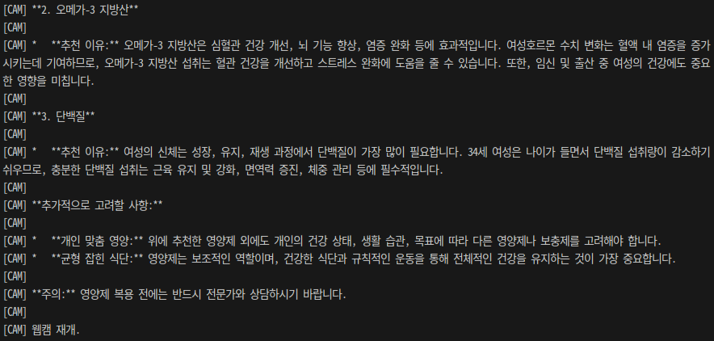
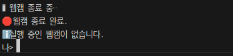

# 🌟TEAM: 조은지안조은지

<p align="center">
<br>
</p>

## 🙋‍♂️팀원

|                                                 **정은지**                                                 |                                                                                                                             **장환**                                                                                                                              |                                                                        **이은성**                                                                        |                                                                                                                             **최현우**                                                                                                                              |
| :--------------------------------------------------------------------------------------------------------: | :---------------------------------------------------------------------------------------------------------------------------------------------------------------------------------------------------------------------------------------------------------------: | :------------------------------------------------------------------------------------------------------------------------------------------------------: | :-----------------------------------------------------------------------------------------------------------------------------------------------------------------------------------------------------------------------------------------------------------------: |
|                                                Team Leader                                                 |                                                                                                                            Validation                                                                                                                             |                                                                  Application Developer                                                                   |                                                                                                                         On-Device Developer                                                                                                                         |
| [ </br> @Eunji Jung](https://github.com/2735C) | [ </br> @Jang Hwan](https://github.com/sundaah) | [ </br> @EunSeong Lee](https://eunseongl.github.io/) | [ </br> @HyenWoo Choi](https://github.com/drgn88) |

## 🖊️Role

### 🦖정은지
- Team leader
- UTKFace DataSet 확보
- 나이 및 성별 추론 모델 학습
  - 라즈베리파이 임베딩 및 성능 개선
  - Image 추론 모델 후처리 보정
- Ubuntu Vs Raspberry Pi 성능 비교

### 이은성
- 나이 및 성별 데이터셋 구축 및 모델 학습
- S/W 개발
- AI 모델 통합 (+ 알고리즘 개선)
- 라즈베리파이 임베딩
  - Application developer(Raspberry pi)
  - Raspberry PI 성능 검증

### 🥊장환
- Validation
- 나이 구간 정확도 검증
- 성별 분류 정확도 검증
- 웹캠 처리 속도 검증

### 🐲최현우
- FPGA & On-device developer
- 나이 및 성별 추론 모델 학습
  - 라즈베리파이 임베딩 및 성능 개선
- Ultra96V2에 추론 모델 포팅
- PYNQ OS importing
- PS - PL에 따른 성능 비교
- FPGA Vs 라즈베리파이 성능 비교

## 🚀프로젝트 개요
**Ai Nutri View**는 웹캠으로 얼굴을 인식해 나이와 성별을 추론하고, 개인에 맞는 영양제를 AI가 추천하는 스마트 헬스케어 시스템입니다.
이 프로젝트는 딥러닝 기반 얼굴 분석 모델과 LLM(Ollama:1b)을 활용하여, 사용자의 정보를 바탕으로 하루 권장량과 추천 이유까지 제공하는 개인 맞춤형 영양제 가이드를 목표로 합니다. <br>

❗추가적으로 **CPU 기반 환경(PC, Raspberry Pi)** 뿐만 아니라 FPGA 기반의 AI 가속기 환경에서도 실험되었으며, 이를 통해 연산 처리 속도 및 전력 효율 측면에서의 최적화를 시도하였습니다.
특히 **Xilinx Ultra96-V2 FPGA 보드에 DPU(Deep Processing Unit)**를 탑재하고, **Vitis-AI 플랫폼**을 활용해 학습된 딥러닝 모델을 **.xmodel로 변환**함으로써, FPGA 보드 상에서의 실시간 얼굴 추론을 가능하게 하였습니다.<br>

🎉 ResNet-50 모델을 기준으로 한 성능 비교 결과, FPGA의 DPU 환경에서 **약 36배 빠른 추론 속도**를 기록하며, **PC 기반보다 에너지 효율성과 응답 시간 측면**에서 유의미한 성능 향상을 보였습니다.<br>

### 🧐문제 인식
현대인은 바쁜 일상 속에서 자신에게 맞는 영양제를 찾기 어렵고, 정보는 넘쳐나지만 정확한 추천은 부족한 실정입니다. 특히 성별, 연령, 건강 상태 등에 따라 필요한 영양소가 다르지만 이를 고려하지 않은 제품 선택은 오히려 건강을 해칠 수 있습니다.
이에 따라 **Ai Nutri View**는 웹캠으로 실시간 얼굴을 인식하여 추론된 나이와 성별 정보를 기반으로, 사용자에게 꼭 필요한 영양제 3가지를 하루 섭취량과 함께 추천함으로써 보다 정확하고 안전한 건강 관리 서비스를 제공하고자 개발되었습니다.

<p align="center">
<br>
</p>

## 🗓️개발 일정 [[상세 일정]](Dev_Sche.md)

### <개발일정 기재 - Gantt Chart>

|                        |  7/1  |  7/2  |  7/3  |  7/4  |  7/5  |  7/6  |  7/7  |  7/8  |  7/9  | 7/10  |
| :--------------------- | :---: | :---: | :---: | :---: | :---: | :---: | :---: | :---: | :---: | :---: |
| 주제 선정              |   O   |       |       |       |       |       |       |       |       |       |
| 역할 분담              |   O   |       |       |       |       |       |       |       |       |       |
| 아이디어 제시          |   O   |   O   |       |       |       |       |       |       |       |       |
| 추론 모델 학습         |       |   O   |   O   |   O   |       |       |       |       |       |       |
| 추론 모델 개발 (PC)    |       |       |       |       |   O   |   O   |   O   |       |       |       |
| 라즈베리파이 임베딩    |       |       |       |       |       |       |   O   |   O   |       |       |
| FPGA 추론 모델 포팅    |       |       |       |       |   O   |   O   |   O   |   O   |       |       |
| FPGA-PS 추론 모델 제작 |       |       |       |       |       |       |       |   O   |   O   |   O   |
| 발표 자료 제작         |       |       |       |       |       |       |       |       |   O   |   O   |


## 학습과정
> 더 많은 내용을 확인하고 싶으면 --> [[발표 자료]](https://github.com/drgn88/ai_age_body_tablet_team4/blob/main/presentation/TEAM4.pdf)


## 통합 모델 기능

### SW Architecture
```
|--- System/
|   |--- Controller.py
|   └── Cam.py
|
|--- Model/
|   |--- Img_DataSet/
|   |--- Age_vgg16.keras
|   └── Gen_ResNet151.keras

```


**[ 실행 ]**
- controller.py 실행하면 Command Line Interface에 올라마 실행됩니다.

|               실행                |
| :-------------------------------: |
|  |

**[ 웹캠 실행 ]**
- CLI에 웹캠실행 명령을 입력하면 웹캠이 실행 됩니다.
- 완료되면 다음과 같은 안내 메시지가 나타납니다.

|             웹캠 실행             |
| :-------------------------------: |
|  |

**[ 나이, 성별 추론 ]**

- 웹캠에 인식되는 사람의 얼굴을 추적하고 나이와 성별을 학습된 모델을 가지고 추론하여 웹캠에 나타냅니다.

|         나이 및 성별 추론         |
| :-------------------------------: |
|  |

**[ Ollama 요청 ]**
- 나이와 성별 데이터를 python 스크립트 내부의 자동완성 prompt를 통해 올라마에 질문합니다.

|            Ollama 요청            |
| :-------------------------------: |
|  |

- Ollama가 답변을 준비하는 동안 웹캠은 닫힌 상태가 됩니다.

|             웹캠 닫힘             |
| :-------------------------------: |
|  |

- Ollama가 답변을 준비하는 동안 스페이스바를 추가 입력하게 되면 다음과 같은 문구가 나타납니다.

| 예외 처리 |
| :---: |
||

**[ Ollama 답변 완료 ]**
- Ollama가 답변 완료 상태가 되면 웹캠은 재개 되고 CLI에 영양제에 대한 정보를 제공합니다.

|             답변 완료             |
| :-------------------------------: |
|  |

**[ 종료 조건 ]**
- 웹캠 종료 조건은 다음과 같습니다.
  - 웹캠 창에서 "q" 입력
  - CLI에 "웹캠 종료"

|             웹캠 종료             |
| :-------------------------------: |
|  |

- 프로세서 종료 조건은 다음과 같습니다.
  - CLI에 "웹캠 종료" 입력

|           프로세서 종료           |
| :-------------------------------: |
|  |


## Ultra96-V2 DPU 구현 과정

### FPGA DPU 구현

<p align="center">
<br>
</p>

## 1. Using PYNQ
### What is PYNQ?

PYNQ: 파이썬으로 Zynq 하드웨어를 쉽게! ✨
---
PYNQ는 "Python Productivity for Zynq"의 약자로, Xilinx Zynq 디바이스를 파이썬으로 쉽고 효율적으로 활용할 수 있게 돕는 오픈소스 프레임워크입니다. 하드웨어 개발 경험이 많지 않아도 Zynq의 강력한 하드웨어 가속 기능을 활용할 수 있도록 설계되었습니다.

PYNQ의 주요 특징 💡
---
> 파이썬 기반 하드웨어 제어 🐍

기존의 복잡한 하드웨어 기술 언어(VHDL, Verilog 등) 대신, 친숙한 파이썬 언어를 사용하여 Zynq 기반 하드웨어 가속기를 프로그래밍하고 제어합니다. 덕분에 하드웨어 전문가가 아니어도 Zynq 디바이스에 쉽게 접근할 수 있습니다.

> Jupyter Notebook 통합 환경 📓

PYNQ는 Jupyter Notebook 환경을 제공하여 웹 브라우저를 통해 코드를 작성하고 실행할 수 있습니다. 실시간 코드 테스트와 결과 확인이 가능하여 개발 효율성을 크게 높여줍니다.

> 오버레이(Overlay) 개념 활용 🛠️

미리 정의된 하드웨어 기능 블록을 **"오버레이"**라고 부르며, 이를 소프트웨어 라이브러리처럼 불러와 사용할 수 있습니다. 이미지 처리, 머신러닝 가속 등 다양한 기능을 포함하는 오버레이를 활용하여 개발 시간을 단축할 수 있습니다.

> 다양한 응용 분야 🌍

임베디드 시스템, 사물 인터넷(IoT), 인공지능(AI) 가속, 로봇 공학 등 넓은 분야에서 PYNQ를 활용할 수 있습니다. 파이썬의 유연성과 Zynq의 강력한 병렬 처리 능력을 결합하여 혁신적인 프로젝트 구현을 가능하게 합니다.

> PYNQ를 사용해야 하는 이유 👍
> 
PYNQ는 하드웨어 설계에 대한 깊은 지식 없이도 Zynq 디바이스의 강력한 병렬 처리 능력을 활용할 수 있도록 돕습니다. 마치 게임 컨트롤러로 복잡한 기계를 조작하듯이, 아이디어를 빠르게 프로토타이핑하고 실제 제품으로 구현하는 데 걸리는 시간을 획기적으로 단축시켜 줍니다.

## 2. Import DPU on PYNQ

```linux
  pip3 install pynq-dpu --no-build-isolation
```
- FPGA에서 DPU를 활성화 시킴

```
cd $PYNQ_JUPYTER_NOTEBOOKS
pynq get-notebooks pynq-dpu -p .
```
- 주피터 노트북에 DPU 관련 파일들을 fetch함

# DPU에 따른 성능 비교

> 자세한 Code는 Issue를 참고
- [ResNET50 성능비교](https://github.com/drgn88/ai_age_body_tablet_team4/issues/2)<br>
- [YoloV3 성능비교](https://github.com/drgn88/ai_age_body_tablet_team4/issues/3)<br>

비교 HW Spec
---
| i7-1260P | Ultra7 155H | Raspberrypi-5-A76 | Ultra96V2-A53 |
| :------: | :---------: | :---------------: | :-----------: |
|  4.7GHz  |   4.8GHz    |      2.4GHz       |    1.5GHz     |

## ResNET50

|     &nbsp;     | i7-1260P | Ultra7 155H | Raspberrypi-5-A76 | Ultra96V2-A53 | Ultra96V2-DPU |
| :------------: | :------: | :---------: | :---------------: | :-----------: | :-----------: |
|      FPS       |   11.1   |    14.22    |       4.23        |     0.54      |     19.63     |
| 처리 시간(sec) |   9.10   |     7.1     |       23.88       |    186.31     |     5.14      |

## YoloV3 

| &nbsp; | Ultra96V2-PS | Ultra96V2-DPU | Raspberrypi-5 | i7-1260P |
| :----: | :----------: | :-----------: | :-----------: | :------: |
|  FPS   |     0.18     |     2.72      |     9.31      |  40.95   |

🌟 DPU Performance: ResNET50 >> YoloV3
---

| 특징                 | ResNet50 (이미지 분류)                                   | YOLOv3 (객체 탐지)                                                                                    |
| :------------------- | :------------------------------------------------------- | :---------------------------------------------------------------------------------------------------- |
| **주요 연산 비중**   | 컨볼루션, 풀링 등 DPU 가속에 최적화된 연산 비중 높음     | 컨볼루션 연산 외에 NMS(Non-Maximum Suppression) 등 CPU 기반 후처리 비중 존재                          |
| **모델 구조 단순성** | 비교적 정형화된 컨볼루션 네트워크 (잔차 블록)            | Darknet-53 백본 + FPN (Feature Pyramid Network), 다중 스케일 예측 등 복잡성 증가                      |
| **DPU 활용 효율**    | DPU의 연산 파이프라인에 잘 맞아 높은 가속 효율           | DPU 가속 범위를 벗어나는 후처리 단계에서 병목 발생 가능                                               |
| **최종 성능 개선**   | 컨볼루션 연산 가속으로 인해 전체 추론 속도 **크게 개선** | 컨볼루션 연산은 가속되나, 후처리 등으로 인해 전체적인 체감 속도 개선 폭이 **상대적으로 작을 수 있음** |
| **주요 병목 지점**   | 거의 없음 (대부분 DPU에서 효율적 처리)                   | NMS 등 **CPU 기반 후처리** 단계가 주요 병목 지점될 가능성 높음                                        |


### PYNQ

## 🚀Trouble Shooting 
[⚒️[Trained AI Model 1]](/trouble_shooting/Trouble_Shooting.md)   <br>
[⚒️[Trained AI Model 2]](/trouble_shooting/Trouble_Shooting1.md)  <br>
[⚒️[Integrated System 1]](/trouble_shooting/Trouble_Shooting2.md) <br>
[⚒️[Integrated System 2]](/trouble_shooting/Trouble_Shooting3.md) <br>
[⚒️[Accelerator 1]](/trouble_shooting/Trouble_Shooting4.md)       <br>
[⚒️[Accelerator 2]](/trouble_shooting/Trouble_Shooting5.md)       <br>
[⚒️[추가할거있으면~]](/trouble_shooting/Trouble_Shooting6.md)      <br>

