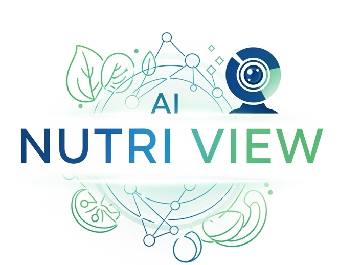
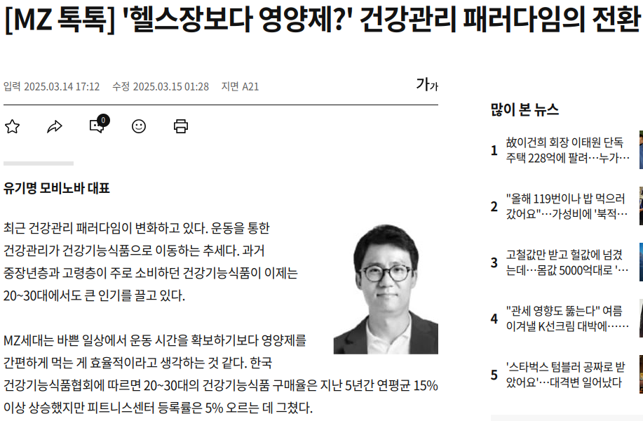

# 🌟TEAM: 조은지안조은지

 

## 🙋‍♂️팀원

|                                                                                                                **정은지**                                                                                                                |                                                                                                                **장환**                                                                                                                 |                                                         **이은성**                                                          |                                                                    **최현우**                                                                     |
| :--------------------------------------------------------------------------------------------------------------------------------------------------------------------------------------------------------------------------------------: | :-------------------------------------------------------------------------------------------------------------------------------------------------------------------------------------------------------------------------------------: | :-------------------------------------------------------------------------------------------------------------------------: | :-----------------------------------------------------------------------------------------------------------------------------------------------: |
|                                                                                                               Team Leader                                                                                                                |                                                                                                               Validation                                                                                                                |                                                    Application Developer                                                    |                                                                On-Device Developer                                                                |
| [   @Eunji Jung](https://github.com/2735C) | [   @Jang Hwan](https://github.com/sundaah) | [   @EunSeong Lee](https://eunseongl.github.io/) | [   @HyenWoo Choi](https://github.com/drgn88) |

## 🖊️Role

### 🦖정은지
- Team leader
- UTKFace DataSet 확보
- 나이 및 성별 추론 모델 학습
  - 라즈베리파이 임베딩 및 성능 개선
  - Image 추론 모델 후처리 보정
- Ubuntu Vs Raspberry Pi 성능 비교

### 이은성
- 나이 및 성별 데이터셋 구축 및 모델 학습
- S/W 개발
- AI 모델 통합 (+ 알고리즘 개선)
- 라즈베리파이 임베딩
  - Application developer(Raspberry pi)
  - Raspberry PI 성능 검증

### 🥊장환
- Validation
- 나이 구간 정확도 검증
- 성별 분류 정확도 검증
- 웹캠 처리 속도 검증

### 🐲최현우
- FPGA & On-device developer
- 나이 및 성별 추론 모델 학습
  - 라즈베리파이 임베딩 및 성능 개선
- Ultra96V2에 추론 모델 포팅
- PYNQ OS importing
- PS - PL에 따른 성능 비교
- FPGA Vs 라즈베리파이 성능 비교

## 🚀프로젝트 개요
**Ai Nutri View**는 웹캠으로 얼굴을 인식해 나이와 성별을 추론하고, 개인에 맞는 영양제를 AI가 추천하는 스마트 헬스케어 시스템입니다.
이 프로젝트는 딥러닝 기반 얼굴 분석 모델과 LLM(Ollama:1b)을 활용하여, 사용자의 정보를 바탕으로 하루 권장량과 추천 이유까지 제공하는 개인 맞춤형 영양제 가이드를 목표로 합니다.  

❗추가적으로 **CPU 기반 환경(PC, Raspberry Pi)** 뿐만 아니라 FPGA 기반의 AI 가속기 환경에서도 실험되었으며, 이를 통해 연산 처리 속도 및 전력 효율 측면에서의 최적화를 시도하였습니다.
특히 **Xilinx Ultra96-V2 FPGA 보드에 DPU(Deep Processing Unit)**를 탑재하고, **Vitis-AI 플랫폼**을 활용해 학습된 딥러닝 모델을 **.xmodel로 변환**함으로써, FPGA 보드 상에서의 실시간 얼굴 추론을 가능하게 하였습니다. 

🎉 ResNet-50 모델을 기준으로 한 성능 비교 결과, FPGA의 DPU 환경에서 **약 36배 빠른 추론 속도**를 기록하며, **PC 기반보다 에너지 효율성과 응답 시간 측면**에서 유의미한 성능 향상을 보였습니다. 

### 🧐문제 인식
현대인은 바쁜 일상 속에서 자신에게 맞는 영양제를 찾기 어렵고, 정보는 넘쳐나지만 정확한 추천은 부족한 실정입니다. 특히 성별, 연령, 건강 상태 등에 따라 필요한 영양소가 다르지만 이를 고려하지 않은 제품 선택은 오히려 건강을 해칠 수 있습니다.
이에 따라 **Ai Nutri View**는 웹캠으로 실시간 얼굴을 인식하여 추론된 나이와 성별 정보를 기반으로, 사용자에게 꼭 필요한 영양제 3가지를 하루 섭취량과 함께 추천함으로써 보다 정확하고 안전한 건강 관리 서비스를 제공하고자 개발되었습니다.

 

## 🗓️개발 일정 [[상세 일정]](Dev_Sche.md)

### <개발일정 기재 - Gantt Chart>

|                        |  7/1  |  7/2  |  7/3  |  7/4  |  7/5  |  7/6  |  7/7  |  7/8  |  7/9  | 7/10  |
| :--------------------- | :---: | :---: | :---: | :---: | :---: | :---: | :---: | :---: | :---: | :---: |
| 주제 선정              |   O   |       |       |       |       |       |       |       |       |       |
| 역할 분담              |   O   |       |       |       |       |       |       |       |       |       |
| 아이디어 제시          |   O   |   O   |       |       |       |       |       |       |       |       |
| 추론 모델 학습         |       |   O   |   O   |   O   |       |       |       |       |       |       |
| 추론 모델 개발 (PC)    |       |       |       |       |   O   |   O   |   O   |       |       |       |
| 라즈베리파이 임베딩    |       |       |       |       |       |       |   O   |   O   |       |       |
| FPGA 추론 모델 포팅    |       |       |       |       |   O   |   O   |   O   |   O   |       |       |
| FPGA-PS 추론 모델 제작 |       |       |       |       |       |       |       |   O   |   O   |   O   |
| 발표 자료 제작         |       |       |       |       |       |       |       |       |   O   |   O   |

## 학습과정
> 더 많은 내용을 확인하고 싶으면 --> [[발표 자료]](https://github.com/drgn88/ai_age_body_tablet_team4/blob/main/presentation/TEAM4.pdf)

## 추론 어플리케이션 과정

## Ultra96-V2 DPU 구현 과정

### FPGA DPU 구현

 

## 🚀Trouble Shooting 
[[Trained AI Model 1]](Trouble_Shooting.md) 
[[Trained AI Model 2]](Trouble_Shooting1.md) 
[[Integrated System 1]](Trouble_Shooting2.md) 
[[Integrated System 2]](Trouble_Shooting3.md) 
[[Accelerator 1]](Trouble_Shooting4.md) 
[[Accelerator 2]](Trouble_Shooting5.md) 

### 이은성

### 장환

### 정은지

### 최현우
