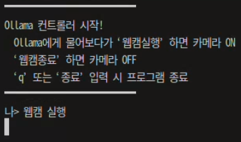

# 🚀Trouble Shooting - Integrated System

## 문제 인지
- Raspberry PI에서 모델 추론 지연
    - PC에서는 동작했던 시스템이 Raspberry PI에서 동작하지 않는 문제가 발생

## 원인 파악
- htop 명령어를 통해 프로세서 리소스 사용량을 확인

- → 초당 1회만 추론하도록 제한했음에도 불구하고, 웹캠과 Ollama를 동시에 실행하면 모든 CPU 코어가 사용되어 성능 저하 및 시스템 불안정 문제가 발생함.

- ❗최적화 필요

